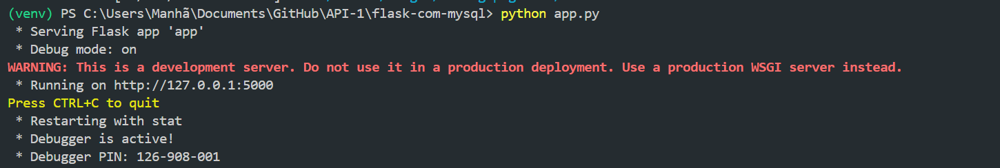

# Future University Website

Bem-vindo ao repositório do site da **Future University**. Este projeto foi desenvolvido com o intuito de aprender a conectar o mysql ao projeto flask, atividade dada pelo professor Jean Costa da Fatec São José Dos Campos

## Índice
- [Descrição do Projeto](#descrição-do-projeto)
- [Tecnologias Utilizadas](#tecnologias-utilizadas)
- [Configuração do Ambiente](#configuração-do-ambiente)
- [Como Contribuir](#como-contribuir)
- [Licença](#licença)

## Descrição do Projeto

O site da Future University permite que os usuários cadastrem novos "alunos" ou usuários.

### Principais Funcionalidades:
- Sistema de cadastro de usuários

## Tecnologias Utilizadas

- **Python**: Linguagem principal do backend. Utilizada para a lógica de negócios e integração com o banco de dados.
- **Flask**: Framework web em Python, escolhido pela sua simplicidade e flexibilidade para construção de APIs e aplicações web.
- **MySQL**: Banco de dados relacional utilizado para armazenar informações de usuários.
- **HTML**: Estruturação do frontend do site, permitindo a exibição das informações na página.
- **Tailwind CSS**: Framework CSS utilizado para estilizar o frontend, permitindo o desenvolvimento de uma interface responsiva e moderna de maneira ágil.
- **C++ e C**: Algumas funcionalidades específicas de processamento intensivo foram desenvolvidas em C++ e C para garantir melhor desempenho.
- **Cython**: Utilizado para compilar partes específicas de código Python para C, acelerando a execução de tarefas críticas de desempenho.
- **PowerShell**: Scripts de automação e configuração do ambiente foram escritos em PowerShell, facilitando o gerenciamento e a execução de tarefas administrativas.

## Configuração do Ambiente

Para configurar e executar o projeto em um ambiente de desenvolvimento, siga as etapas abaixo:

1. **Pré-requisitos**:
   - Python 3.x
   - MySQL
   - C e C++ (para funcionalidades específicas compiladas)
   - PowerShell (para automação de tarefas no Windows)

2. **Instalação de Dependências**:
   Clone o repositório e instale as dependências:

   **Clonando arquivo do github**
   No seu terminal coloque o comando:
   ```
   git clone https://github.com/seu-usuario/future-university-website.git
   code .
   ```
   **Inicialização do projeto**
   Agora dentro do seu projeto no vscode abra o terminal clicando em Ctrl + '' e escreva o seguinte comando:
   Entre na raiz do projeto:
   ```
   cd flask-com-mysql
   ```
   Instale a pasta venv no seu projeto
   --A pasta venv é criada para conter um ambiente virtual em projetos Python, e serve para isolar dependências e pacotes que o projeto específico utiliza. Com isso, evita-se conflitos com          outras versões de pacotes instalados globalmente no sistema ou em outros projetos.
   ```
   python -m venv venv
   ```
   Agora ative o ambiente virtual:
   ```
   source venv/bin/activate  # ou venv\Scripts\activate no Windows
   ```
   Agora dentro do ambiente virtual instale os arquivos necessários para o projeto funcionar:
   ```
   pip install -r requirements.txt
   ```
   Agora inicialize o projeto e clique no IP que aparecera pra você:
   ```
   python app.py
   ```
   
